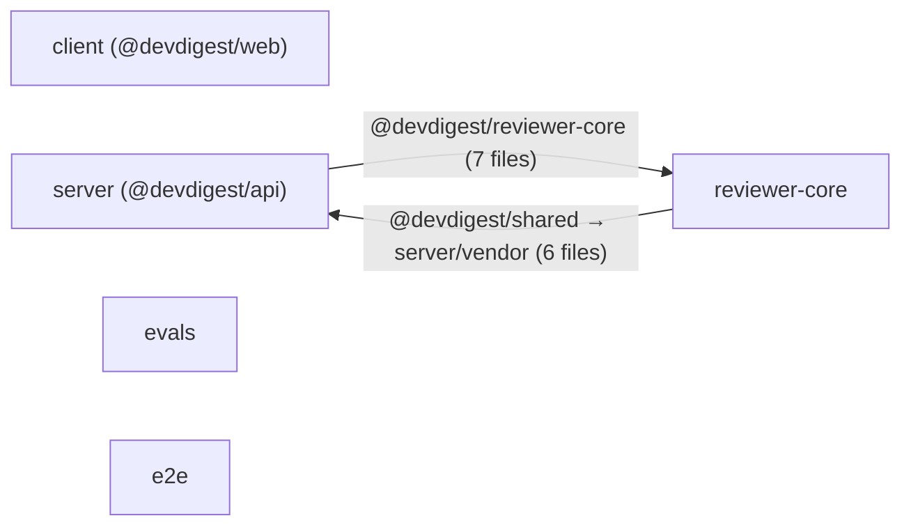

# Dependency Report — dev-digest

_Generated 2026-08-23. Source data: `deps.json` (regenerate with the dependency-checker skill)._

## 1. Overview

Five components in a polyrepo-style layout (no shared root workspace — each installs its
own `node_modules`). Three on **pnpm** (`client`, `evals`, `server`), two on **npm**
(`e2e`, `reviewer-core`). Between them they declare **37 production deps** and **32
devDeps**, occupying **~604 MB on-disk** (install footprint with pnpm symlinks
dereferenced — *not* shipped bundle size). `e2e` has nothing installed in this tree.
Managers are mixed, so upgrade commands are per-component (`pnpm add` in client/evals/server,
`npm i` in e2e/reviewer-core).

| Component | Package | Manager | Deps (prod/dev) | Installed pkgs | On-disk |
|-----------|---------|---------|-----------------|----------------|---------|
| client | @devdigest/web | pnpm | 11 / 12 | 30 | 337 MB |
| server | @devdigest/api | pnpm | 22 / 8 | 35 | 102 MB |
| reviewer-core | @devdigest/reviewer-core | npm | 2 / 4 | 210 | 126 MB |
| evals | @devdigest/evals | pnpm | 2 / 5 | 7 | 39 MB |
| e2e | @devdigest/e2e | npm | 0 / 3 | 0 (not installed) | — |
| mcp-server | _(no package.json)_ | — | — | orphan | — |

Note the mismatch on `reviewer-core`: 2+4 declared deps but **210 installed packages**.
It's an npm flat `node_modules` that pulls a full build/test toolchain (vite, esbuild,
rollup, babel, eslint) transitively — the heaviest per-declared-dep footprint in the repo.

## 2. Internal dependency graph

Components don't declare each other as workspace packages — coupling is via TypeScript path
aliases (`tsconfig.json` → `compilerOptions.paths`). Resolving them:

- **client**: `@devdigest/shared` → `./src/vendor/shared`, `@devdigest/ui` → `./src/vendor/ui`
  — both vendored *inside* client → internal modules, not edges.
- **server**: `@devdigest/shared` → `./src/vendor/shared` (vendored inside server → not an
  edge); `@devdigest/reviewer-core` → `../reviewer-core/src` → **real edge server → reviewer-core**.
- **reviewer-core**: `@devdigest/shared` → `../server/src/vendor/shared` — reviewer-core has
  no own vendored `shared`; it reaches into **server's** → **real edge reviewer-core → server**.

**Cycle: `server ↔ reviewer-core`.** server imports reviewer-core's review engine, while
reviewer-core imports its shared contracts from `server/src/vendor/shared`. It's a soft
cycle — reviewer-core depends only on server's *vendored shared contracts*, not server's
runtime — but physically it's a two-way cross-directory edge and an architectural smell.
The clean fix: give `shared` a single home (a real package, or one vendored copy both
import from) so neither component points into the other.

`client`, `evals`, and `e2e` have **no** cross-component edges — client renders from its own
vendored `shared`/`ui`; evals and e2e are standalone harnesses.

**Excluded (clone noise):** the collector reported `server → @devdigest/ui` (138) and an
inflated `@devdigest/shared` (355). Those counts come from `server/clones/` — external
repositories the product clones to *review* (e.g. `ai-agentic-engineering-neo`,
`LepishkoVadim`), not server's own source (0 real `@devdigest/ui` importers under
`server/src`; ~42 real `@devdigest/shared`). They're review inputs, not dependencies, and
are dropped from the graph.

## 3. External dependencies by size

On-disk footprint, heaviest installed packages per component (largest first).

**client — 337 MB (30 pkgs)**

| Package | On-disk | Notes |
|---------|---------|-------|
| next | 154 MB | Framework; unavoidable, dominates the footprint. |
| mermaid | 75 MB | Diagram renderer — very heavy for one feature; candidate for `next/dynamic` lazy import or a lighter renderer. |
| lucide-react | 36 MB | Icon set; tree-shakes at bundle time, but big on disk. |
| typescript | 23 MB | dev-only. |
| prettier | 9.7 MB | dev-only. |
| react-dom | 7.1 MB | Runtime. |
| recharts | 5.3 MB | Charts. |
| zod | 4.7 MB | Runtime; shared with server/reviewer-core (§4). |
| jsdom | 4.3 MB | dev-only (test DOM). |

**server — 102 MB (35 pkgs)**

| Package | On-disk | Notes |
|---------|---------|-------|
| typescript | 23 MB | dev-only. |
| js-tiktoken | 20 MB | Tokenizer; large data tables. Keep if token counting is needed — confirm it's server-side only, not bundled to client. |
| drizzle-orm | 13 MB | ORM runtime. |
| openai | 7.6 MB | Runtime; shared (§4). |
| drizzle-kit | 7.4 MB | dev-only (migrations). |
| zod | 4.7 MB | Runtime; shared (§4). |
| eslint | 3.8 MB | dev-only. |
| fastify | 3.6 MB | HTTP framework runtime. |
| graphology | 2.7 MB | Graph algorithms. |

**reviewer-core — 126 MB (210 pkgs)**

| Package | On-disk | Notes |
|---------|---------|-------|
| typescript | 23 MB | dev-only. |
| vite / esbuild / @esbuild/linux-x64 | 35 MB | dev toolchain, pulled transitively by vitest. |
| openai | 10 MB | Runtime (one of only two prod deps). |
| zod | 5.1 MB | Runtime; shared (§4). |
| eslint / @typescript-eslint/* | ~9 MB | dev-only; not in this package's manifest — flat-npm transitive. |
| rollup / @babel/* | ~10 MB | dev-only transitive. |

The bulk is **dev/test tooling installed flat by npm**, for a package whose runtime is just
`openai` + `zod`. The widest tree in the repo — moving it onto the pnpm workspace would let
it share this toolchain instead of duplicating it.

**evals — 39 MB (7 pkgs)**

| Package | On-disk | Notes |
|---------|---------|-------|
| typescript | 23 MB | dev-only. |
| openai | 7.6 MB | OpenRouter/OpenAI engine. |
| @anthropic-ai/claude-agent-sdk | 3.6 MB | Anthropic engine. |
| @types/node | 2.5 MB | dev-only. |
| vitest | 1.9 MB | dev-only. |

## 4. Duplication & version conflicts

**Version conflicts** (same package, different declared ranges — rank first):

| Package | Components & ranges | Risk |
|---------|--------------------|------|
| typescript | evals `^5.6.0` vs client/e2e/reviewer-core/server `^5.7.2` | Low — evals lags a minor; align to `^5.7.2`. |
| @types/node | evals `^22.0.0` vs others `^22.10.0` | Low — same major; align to `^22.10.0`. |
| vitest | evals `^2.1.0` vs others `^2.1.8` | Low — align to `^2.1.8`. |
| tsx | evals `^4.19.0` vs others `^4.19.2` | Low — align to `^4.19.2`. |

Every conflict is **`evals` trailing the rest** by a patch/minor. All ranges are
caret-compatible, so installs likely already resolve to the same version — the risk is
drift over time, not a live break. One pass bumping evals closes it.

**Duplicates** (declared by multiple components, no range conflict — lower risk):
`typescript` (5×), `@types/node` (5×), `vitest` (4×), `tsx` (4×), `zod` (3×: client,
reviewer-core, server), `openai` (3×: evals, reviewer-core, server). Natural cost of a
polyrepo layout with no shared root — a single pnpm workspace with a `catalog:` would
collapse these to one declaration each.

## 5. Security audit

All audits ran (`status: ok`) with network available — these are real counts, not a failed
audit. **Every installed component reports at least one critical**, which strongly suggests
one shared vulnerable transitive dependency.

| Component | Critical | High | Moderate | Low | Status |
|-----------|----------|------|----------|-----|--------|
| client | 1 | 10 | 18 | 3 | ok |
| server | 1 | 17 | 14 | 3 | ok |
| evals | 1 | 8 | 10 | 1 | ok |
| reviewer-core | 1 | 4 | 3 | 0 | ok |
| e2e | 0 | 0 | 0 | 1 | ok |

The collector reports counts only, not advisory names. For the actual CVEs and fix paths,
run the audit per component: `pnpm audit` (client, evals, server) and `npm audit` (e2e,
reviewer-core). Patch the recurring critical first — it likely clears in four components at
once. `server` (1 crit / 17 high) is the largest surface.

## 6. Prioritized recommendations

1. **[Critical] Identify and patch the audit findings — every installed component.** Run
   `pnpm audit --fix` (client, evals, server) and `npm audit fix` (reviewer-core), review
   what remains for manual upgrades. Start with the critical common to four components —
   almost certainly one shared transitive dep; an override on it likely clears the bulk.
   `server` (1 crit / 17 high) and `client` (1 crit / 10 high) are the worst surfaces.

2. **[High] Delete the orphaned `mcp-server/node_modules`.** No `package.json`, so it's a
   stale install with nothing to track it: `rm -rf mcp-server/node_modules`.

3. **[High] Break the `server ↔ reviewer-core` cycle.** reviewer-core imports
   `@devdigest/shared` from `../server/src/vendor/shared` while server imports
   reviewer-core. Give `shared` a single home both import from (a real workspace package, or
   move the vendored copy out of `server/`) so the edge goes one way.

4. **[High] Align `evals` toolchain versions.** In `evals/package.json` bump `typescript`
   → `^5.7.2`, `@types/node` → `^22.10.0`, `vitest` → `^2.1.8`, `tsx` → `^4.19.2`, then
   `pnpm install`. Closes all four version conflicts.

5. **[Medium] Move `reviewer-core` (and `e2e`) onto the pnpm workspace.** reviewer-core's
   flat-npm install is **126 MB / 210 packages** for a library whose runtime is just
   `openai` + `zod`; the rest is a duplicated vite/esbuild/rollup/eslint toolchain. Adopting
   pnpm + a workspace `catalog:` for shared dev/runtime deps deduplicates it against the
   other components. An untracked `evals/pnpm-workspace.yaml` already exists — extend it to
   cover all five components.

6. **[Medium] Trim `mermaid` (75 MB) in client.** If diagrams render on a few routes, load
   it via `next/dynamic` / dynamic `import()` so it stays out of the main bundle, or use a
   lighter renderer. Separately, confirm `js-tiktoken` (20 MB, server) is server-side only
   and never shipped to the client.

7. **[Low] Consolidate shared runtime deps.** Pin `zod` (client, reviewer-core, server) and
   `openai` (evals, reviewer-core, server) to one version via the workspace catalog once #5
   lands, so all components move together.
