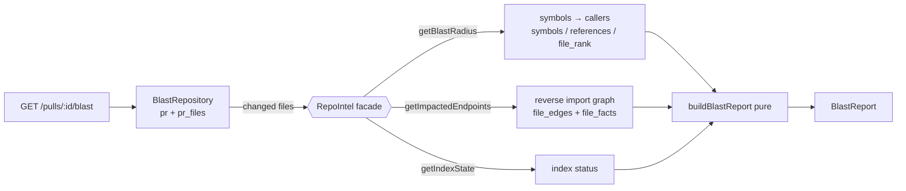

# `blast` — Blast Radius (L04)

Answers the reviewer's first question about a diff: **"what else could this touch?"**
For a PR it returns the symbols declared in the changed files, their cross-file
**callers**, the HTTP **endpoints** / **crons** those callers register, and the
**prior PRs** that touched the same files — built entirely from the `repo-intel`
index. **No LLM, no clone re-parse** on the request path. Rendered as the
**BLAST RADIUS** card in the PR **Overview** (next to Intent), with a Tree/Graph
view toggle.

## Route

- `GET /pulls/:id/blast` → [`BlastReport`](../../vendor/shared/contracts/blast.ts)

`status` is one of `ok` / `partial` / `degraded` / `empty` and is derived in code —
missing data is never masked as an empty `ok` (see `deriveStatus` in `service.ts`).

## Flow

## Files

| File             | Layer          | Role |
|------------------|----------------|------|
| `routes.ts`      | presentation   | the Fastify plugin; resolves the PR, calls the facade, shapes the reply |
| `repository.ts`  | infrastructure | the only DB reads (PR row + `pr_files`); keeps the ORM out of `routes.ts` |
| `service.ts`     | application    | **pure** shaping (`groupCallersBySymbol`, `deriveStatus`, `buildBlastReport`) |

The reverse-graph traversal and per-symbol caller cap live in the facade
(`modules/repo-intel/service.ts`: `getImpactedEndpoints`, `reverseReachable`,
`capCallersPerSymbol`) because that module owns the index tables.

## Consumers

- Studio **BLAST RADIUS** card in the PR Overview
  (`client/.../_components/BlastCard`) — symbols are shown top-N by importance,
  with the rest behind a "See all" modal.
- MCP tool `devdigest_get_blast_radius` (`mcp-server`), which calls this same route.
