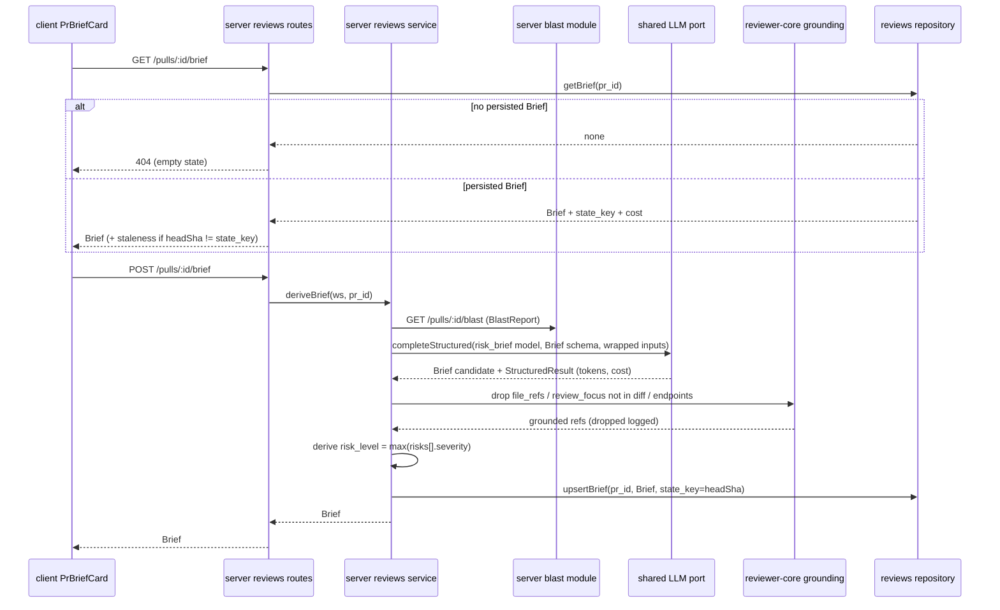

# Spec: PR Why + Risk Brief

Spec ID:    SPEC-2026-08-16-pr-why-risk-brief
Status:     draft
Supersedes: none
Modules:    server · client · reviewer-core
Plan:       ./2026-08-16-pr-why-risk-brief.plan.md
PR:         none

## Problem and user

A reviewer opening a pull request in the DevDigest studio sees the raw diff, the
deterministic Blast Radius, and (if derived) the PR Intent — but nothing that
answers, in one place, the two questions a reviewer asks first: **what is this PR
trying to do, and where is it most likely to hurt?** Today they reconstruct that
themselves by reading the description, cross-referencing the linked issue, and
scanning the blast tree. On a large or unfamiliar PR that is minutes of context
assembly per review, and the "read these first" files that concentrate the risk
are never surfaced — a reviewer can spend their attention on trivial changes and
skim the migration or auth change that actually needed it.

The PR Intent feature (`server/src/modules/reviews/service.ts:187` at HEAD)
already assembles most of the raw material — intent, linked issue, spec/plan
docs — but produces only a narrative intent, not a risk-ranked, file-anchored
brief a reviewer can act on.

## Goals / Non-goals

Goals:
- Derive one structured **Brief** per PR: a plain-language *what* and *why*, a
  code-derived overall `risk_level`, a list of risk areas each anchored to a real
  changed file or impacted endpoint, and a "read these first" **review focus**
  list of file:line links with a short reason each.
- Cache the Brief per PR head SHA; expose an explicit regenerate action that
  re-derives regardless of cache state.
- Render the Brief in a new `PrBriefCard` at the top of the Pull Request Overview,
  including the existing review verdict/score/findings context alongside it.
- Ground every file reference in the Brief against the actual diff and blast
  index, dropping any the model invented.

Non-goals:
- **No in-app file viewer.** Every file:line reference is a GitHub blob link
  (`githubBlobUrl`, `client/src/lib/github-urls.ts:24` at HEAD); there is no new
  in-app file-view route.
- **No new review run.** Verdict, score and findings counts are read from the
  existing reviews/findings tables (`server/src/db/schema/reviews.ts:10-52` at
  HEAD); this feature does not run or trigger a review.
- **No revival of the dormant `PrBrief {intent, blast, risks, history}` contract**
  (`server/src/vendor/shared/contracts/brief.ts:151` at HEAD). Nothing produces or
  consumes it; this spec defines a new `Brief` shape instead.
- No sending of diff hunk bodies to the LLM — only hunk-header digests and stats.
- No streaming of the Brief; it is a single structured call returned whole.
- No per-risk user editing, dismissal, or annotation of the Brief.

## User stories

- As a code reviewer, I want a one-glance *what/why* and a ranked list of risk
  areas anchored to real files, so that I know where to spend my attention before
  reading the diff.
- As a code reviewer, I want a "read these first" list of file:line links, so that
  I open the highest-risk lines first instead of reading top-to-bottom.
- As a code reviewer, I want to regenerate the Brief when the PR has changed since
  it was derived, so that I am not acting on a stale summary.
- As a reviewer opening a PR that was never briefed, I want a clear way to generate
  the Brief, so that the absence of one is not mistaken for "no risk".

## Acceptance criteria (EARS)

AC-1. WHEN a client requests `GET /pulls/:id/brief` and a Brief has been persisted
      for that PR, the system shall return the persisted Brief together with its
      stored `state_key` and its generation cost fields (`tokensIn`, `tokensOut`,
      `costUsd`, `model`).

AC-2. IF a client requests `GET /pulls/:id/brief` and no Brief has ever been
      derived for that PR, THEN the system shall respond `404` with an error
      message identifying the PR, and shall not derive a Brief.

AC-3. WHEN a client requests `POST /pulls/:id/brief`, the system shall gather the
      PR intent, blast summary, diff/file stats, hunk-header digest, linked issue,
      and referenced spec/plan documents, derive a Brief via the `risk_brief`
      feature-model, persist it keyed by the current PR head SHA in `state_key`,
      and return the Brief.

AC-4. The system shall compute the Brief `risk_level` in code as the maximum
      severity across all `risks[]` items (`high` > `medium` > `low`), and shall
      not use any risk level reported by the model.

AC-5. The system shall drop from `risks[].file_refs` and from `review_focus[]` any
      file path not present in the diff's changed files and any endpoint not
      present in the blast report's `impacted_endpoints`, and shall log each
      dropped reference.

AC-6. WHEN `POST /pulls/:id/brief` is called for a PR that already has a persisted
      Brief, the system shall re-derive and overwrite the stored Brief and its
      `state_key` regardless of whether the current head SHA matches the stored
      `state_key`.

AC-7. IF more than 6 `POST /pulls/:id/brief` requests arrive within 1 minute for a
      workspace, THEN the system shall reject the excess with the framework rate-
      limit response and shall not derive a Brief for the rejected requests.

AC-8. IF the structured LLM call for the Brief fails after its configured retries,
      THEN the system shall respond with an error carrying the provider error
      message verbatim, and shall not persist a partial Brief.

AC-9. WHEN a Brief exists and the PR's current head SHA differs from the Brief's
      stored `state_key`, the system shall render the `PrBriefCard` with a
      staleness banner reading "PR changed since this brief — regenerate" and shall
      keep the persisted Brief visible until regenerated.

AC-10. WHEN the Overview loads and no Brief exists for the PR (`GET` returned
       `404`), the system shall render the `PrBriefCard` empty state with a
       "Generate brief" call to action and no risk content.

AC-11. WHILE a `POST /pulls/:id/brief` request is in flight, the system shall
       render a loading skeleton in the `PrBriefCard` and shall disable the
       generate/regenerate control until the request settles.

AC-12. IF a `POST /pulls/:id/brief` request fails, THEN the `PrBriefCard` shall
       render an error state that displays the provider or request error message
       verbatim and re-enables the generate/regenerate control.

AC-13. WHEN a Brief has an empty `risks[]` array, the system shall render the Risk
       Areas section with an explicit "No risk areas identified" empty row rather
       than an empty container.

AC-14. WHEN a `risks[]` item or `review_focus[]` item is rendered and the PR's
       `repoFullName` or `headSha` is unavailable, the system shall render the
       file:line reference as plain text instead of a GitHub blob link.

AC-15. WHEN the Overview loads and no review has ever run for the PR, the system
       shall render the verdict area in an empty state (no verdict label, no score
       gauge, no findings chip) rather than a default or zero verdict.

AC-16. WHERE a review verdict exists whose review predates the current Brief's
       `state_key`, the system shall render the verdict and the Brief independently
       and shall not suppress or reconcile one against the other beyond each
       showing its own staleness state.

AC-17. WHEN a risk area row receives keyboard focus and the reader activates it
       (Enter or Space), the system shall toggle the accordion body, expose the
       expanded/collapsed state to assistive technology, and keep focus on the
       activated row.

AC-18. WHEN the blast report status is `degraded` or `empty`, the system shall
       still derive and persist a Brief, with `impacted_endpoints`-sourced
       references omitted and `review_focus[]` limited to changed-file references.

## Edge cases

- No Brief ever derived → `GET` returns `404` (AC-2); card shows empty state
  (AC-10).
- LLM call fails after retries → error surfaced verbatim, nothing persisted
  (AC-8, AC-12).
- Model returns a file path not in the diff → reference dropped and logged (AC-5).
- Model reports its own risk level → ignored; level is code-derived (AC-4).
- `risks[]` empty → explicit empty row, not blank container (AC-13).
- `repoFullName`/`headSha` missing → file:line rendered as plain text (AC-14).
- PR head SHA advanced since derivation → staleness banner, stale Brief still shown
  (AC-9).
- Regenerate pressed while Brief is fresh → re-derives anyway (AC-6).
- No review has run → verdict area empty, not zeroed (AC-15).
- Verdict from an older review beside a fresh Brief → shown independently (AC-16).
- Rapid repeated regenerate presses → control disabled while in flight (AC-11);
  server rate-limits beyond 6/min (AC-7).
- Blast report `degraded`/`empty` → Brief still derived, endpoint refs omitted
  (AC-18).

## Design review

Design artefacts supplied: user screenshots only (no design files). Dark-theme
Overview with a PR BRIEF header + verdict card, two-column INTENT / BLAST RADIUS
body, expandable RISK AREAS rows, and a full-width REVIEW FOCUS section.

| # | Screen / flow | What is missing | Consequence | Proposal | Severity |
|---|---------------|-----------------|-------------|----------|----------|
| 1 | PrBriefCard, first load | Screenshots show a populated card only — no empty state for a never-briefed PR | Reviewer cannot tell "no Brief" from "no risk" | Empty state with "Generate brief" CTA (AC-10) | blocker |
| 2 | PrBriefCard, generation | No loading representation shown | Blank card during the LLM call reads as broken | Skeleton + disabled control while in flight (AC-11) | blocker |
| 3 | PrBriefCard, failure | No error representation shown | Silent failure; reviewer acts on nothing | Error state with verbatim provider error (AC-12) | blocker |
| 4 | Verdict card | Screenshot always shows a verdict; no state for a PR with no review | A zeroed/absent verdict reads as "approved with score 0" | Empty verdict state when no review has run (AC-15) | blocker |
| 5 | Verdict vs Brief freshness | Verdict and Brief have separate lifecycles; screenshots do not show them disagreeing | Reviewer may read a fresh Brief as endorsing a stale verdict or vice versa | Render independently, each with its own staleness (AC-9, AC-16) | major |
| 6 | RISK AREAS section | No zero-risk representation | Empty container reads as a loading bug | Explicit "No risk areas identified" row (AC-13) | major |
| 7 | file:line links | Link target assumes `repoFullName` + `headSha` present | Broken/empty href when repo metadata missing | Plain-text fallback (AC-14) | major |
| 8 | RISK AREAS accordion & Recalculate | No keyboard/focus behaviour specified | Accordion and regenerate unusable by keyboard/SR users | Keyboard toggle + aria-expanded + focus retention (AC-17); double-submit disable (AC-11) | major |
| 9 | Blast unavailable | Screenshots assume a full blast tree | With degraded/empty blast, endpoint refs and focus list are undefined | Derive anyway, omit endpoint refs, limit focus to changed files (AC-18) | minor |

No unresolved `blocker` rows remain: items 1–4 are each covered by an acceptance
criterion in this spec.

## Module contracts

| From | To | Channel | New or existing |
|------|----|---------|-----------------|
| client `PrBriefCard` | server reviews routes | `GET /pulls/:id/brief` → persisted `Brief` + `state_key` + cost fields, or `404` | new route |
| client `PrBriefCard` | server reviews routes | `POST /pulls/:id/brief` (rate-limit max 6 / 1 min) → derived `Brief` | new route |
| client hooks (`client/src/lib/hooks/reviews.ts`, mirroring `:150` GET / `:160` POST at HEAD) | client `PrBriefCard` | `useBrief` (GET) + `useDeriveBrief` (POST mutation) | new hooks |
| server reviews service | `@devdigest/shared` | `Brief` Zod schema in `server/src/vendor/shared/contracts/brief.ts` (source); mirrored to client via `./scripts/sync-shared.sh` | new schema |
| server reviews service | shared LLM port | `completeStructured({ model, schema, schemaName, messages, temperature: 0, maxTokens })` (`server/src/adapters/llm/openai.ts:88` / `anthropic.ts:89` at HEAD) → `StructuredResult` with `tokensIn/tokensOut/costUsd/model` (`server/src/vendor/shared/adapters.ts:72` at HEAD) | existing |
| server reviews service | platform | `resolveFeatureModel(container, ws, 'risk_brief')` (feature-model default `openai/gpt-4.1`, `server/src/vendor/shared/contracts/platform.ts:62` at HEAD) | existing |
| server reviews service | server reviews repository | `upsertBrief` / `getBrief` over the existing `pr_brief` table (`server/src/db/schema/reviews.ts:76` at HEAD), replacing the dormant `json` payload shape and **adding a `state_key` column** | table exists; column new |
| server reviews service | server intent | intent sources reused via existing intent gathering (`service.deriveIntent`, `server/src/modules/reviews/service.ts:187-317` at HEAD) | existing |
| server reviews service | server blast module | `GET /pulls/:id/blast` `BlastReport` (`server/src/vendor/shared/contracts/blast.ts:100` at HEAD) as risk/endpoint input | existing |
| server grounding | reviewer-core | `groundFindings`-style changed-files filter reused for `risks[].file_refs` / `review_focus[]` (`reviewer-core/src/grounding.ts:56-66` at HEAD) | existing pattern |
| server prompt assembly | reviewer-core | `wrapUntrusted` + `capText` on every untrusted input (`reviewer-core/src/prompt.ts:30` at HEAD) | existing |
| client `PrBriefCard` | client github-urls | `githubBlobUrl(repoFullName, headSha, file, line)` via `<MonoLink>`, plain-text fallback (`client/src/lib/github-urls.ts:24` at HEAD) | existing |
| server reviews routes | server reviews repository | verdict/score/findings read from `reviews` + `findings` tables (`server/src/db/schema/reviews.ts:10-52` at HEAD) | existing |

## Non-functional requirements

| # | Requirement | Target | How it is verified |
|---|-------------|--------|--------------------|
| NFR-1 | Brief generation prompt excludes diff hunk bodies | 0 hunk-body lines in the assembled prompt (only hunk-header digest + stats) | Inspect the messages passed to `completeStructured` for a PR with non-empty diffs; assert no hunk body content present |
| NFR-2 | `GET /pulls/:id/brief` latency for a persisted Brief | p95 under 100 ms measured server-side, no LLM call on the path | Server-side timing of `GET /pulls/:id/brief` under 50 concurrent requests |
| NFR-3 | POST rate limit | 6 requests / 1 minute / workspace on `POST /pulls/:id/brief` | Send 7 POSTs within 60 s; the 7th is rejected by the rate limiter |
| NFR-4 | Grounding drop observability | Every dropped file/endpoint reference emits one structured log line naming PR id and dropped ref | Derive a Brief with an injected hallucinated path; assert one log line per drop |
| NFR-5 | Cost line accuracy | The cost line renders `costUsd`, `tokensIn`, `tokensOut` from the Brief's own `StructuredResult`, not from any review | Compare rendered cost values against the persisted Brief's `StructuredResult` fields |
| NFR-6 | Accordion accessibility | Each risk row exposes `aria-expanded` reflecting its state; the generate/regenerate control has an accessible name | Automated a11y assertion on the rendered card in expanded and collapsed states |
| NFR-7 | Structured-output determinism | Brief LLM call uses `temperature: 0` | Inspect the `completeStructured` call arguments |

## Inputs and provenance

| Input | Origin | Who controls it | Trusted? |
|-------|--------|-----------------|----------|
| PR id (`:id`) | client route param, validated by `IdParams` | authenticated caller | trusted after validation + workspace scope |
| PR title, body | GitHub PR, via existing gather | PR author (external) | untrusted |
| Linked issue body | GitHub issue via `LINKED_ISSUE_PATTERN` + `gh.getIssue` | issue author (external) | untrusted |
| Spec/plan doc bodies | repo files via `extractDocRefs` + git `readFileSafe` (SSRF-safe, no HTTP) | repo contributors (external) | untrusted |
| Diff/file stats + hunk-header digest | computed from the PR diff | derived from external diff | untrusted content, trusted structure |
| Blast summary (`BlastReport`) | deterministic index (`GET /pulls/:id/blast`) | server-computed from repo index | trusted structure; file/endpoint names originate from repo |
| PR head SHA (`state_key`) | server-known PR metadata | server | trusted |
| `risk_brief` model selection | `resolveFeatureModel` platform config | workspace config | trusted |
| LLM output (`Brief` candidate) | provider structured completion | model (external) | untrusted |
| Verdict / score / findings count | `reviews` + `findings` tables | server (prior review runs) | trusted |
| `repoFullName`, `headSha` (link building) | Overview props | server | trusted |

## Untrusted inputs

- **PR title, body, linked issue, spec/plan doc bodies** feed the Brief prompt.
  Every such part is wrapped with `wrapUntrusted` and length-capped with `capText`
  (`reviewer-core/src/prompt.ts:30`, `server/src/modules/reviews/intent.ts:189-227`
  at HEAD) so injected instructions are framed as data, not directives. Sources
  that cannot be read are listed under a "## Missing context" section, never
  fabricated. (OWASP A05 injection / prompt injection; Agentic AI ASI01 goal
  hijacking.)
- **LLM output (`Brief` candidate)** is untrusted. Its file references are grounded
  against the diff's changed files and the blast report's `impacted_endpoints`
  before persistence; any reference to a path/endpoint not in the input is dropped
  and logged (AC-5, NFR-4), mirroring `groundFindings`
  (`reviewer-core/src/grounding.ts:56-66` at HEAD). The model-reported risk level
  is discarded in favour of the code-derived max severity (AC-4). This prevents the
  Brief from directing a reviewer to invented or out-of-scope locations. (Agentic
  AI ASI09 trust exploitation.)
- **Rendered Brief text** (`what`, `why`, risk `title`/`explanation`, focus
  reasons) is model-generated and displayed. It is rendered as text through React's
  default JSX escaping — never via `dangerouslySetInnerHTML` — and file:line values
  are used only to build `githubBlobUrl` links, not raw `href` from model text.
  (OWASP A05 XSS; ASI09.)
- **No hunk bodies** are sent to the model (NFR-1), reducing both the injection
  surface and token cost.

## Open questions

None. All five phase-1 blocking questions were answered authoritatively (link
target = GitHub blob; data model = new `Brief` in existing `pr_brief` column +
`state_key`; cache key = head SHA; verdict card in scope; `risk_level` code-derived
enum). No assumptions remain standing in for an unresolved decision.
