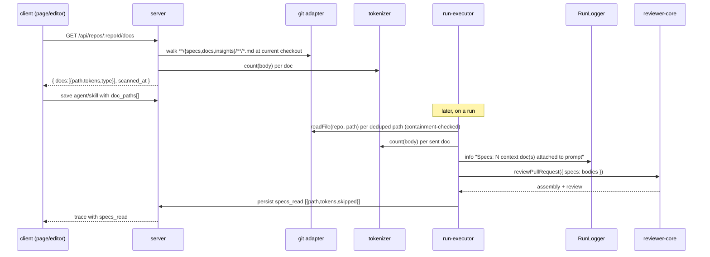

# Spec: Project Context

Spec ID:    SPEC-2026-08-16-project-context
Status:     approved
Supersedes: none 
Modules:    client · server
Plan:       none
PR:         none

## Problem and user

A reviewer agent today reviews a diff with no access to the project's own written
rules — the architecture decisions, API-contract notes, and coding-standard docs
that live *as `.md` files in the repo* (`specs/…`, `docs/…`, `insights/…`). The
prompt already reserves a **`## Project context`** slot for exactly this
(`reviewer-core/src/prompt.ts:47,103-106,138`), but nothing ever fills it: every
run sends no `specs`, and the trace always persists `specs_read: []`
(`server/src/modules/reviews/run-executor.ts:326,511`). The `specs_read` trace
field exists in the contract (`server/src/vendor/shared/contracts/trace.ts:90`)
and a renderer already lists it (`TraceBody.tsx:38-50`) — a dangling,
always-empty pathway. The sidebar already carries a **"Project Context"** nav item
under WORKSPACE (`client/src/vendor/ui/nav.ts:27`, `href: /project-context`) that
routes to a page which does not exist yet.

Two people hurt. **The reviewer reader** gets findings that contradict decisions
already written down in the repo, and misses project-specific violations a human
would catch with "you know we don't do that here." **The agent owner**
configuring a reviewer in the studio has no way to point an agent (or a shared
skill) at those repo docs, and no way to browse what docs even exist for the
selected project.

This feature is scoped to v1 = **read + attach only**. It gives the owner three
surfaces to browse the selected project's `.md` docs and attach chosen ones to an
agent or a skill (storing paths, never text), and it fills the dormant `specs`
slot at run time with the raw bodies of the attached docs, wrapped by the existing
untrusted-injection defense.

## Goals / Non-goals

Goals:
- Add a top-level **Project Context page** (a Reader) that lists the `.md` docs
  found in the currently-selected repo's clone under configurable roots, previews
  a selected doc's rendered markdown, and shows a per-doc "Used by N agents" count.
- Add a **Context tab** to the agent editor and a **Context section** to the skill
  editor where the owner browses those same docs, attaches/detaches them
  (checkbox), reorders attached docs (drag — order is load-bearing), filters, and
  previews, with save-on-change (no separate Save button).
- Store attachments as an **ordered `string[]` of repo-relative paths** on the
  agent and on the skill row (no doc text stored, no repo id stored on the
  attachment — the repo is the selected-project context).
- At run time, resolve the agent's attached docs first, then the docs inherited
  from its linked skills (skill-link order, dedup), read each from the clone
  (containment-checked, size-capped), token-count server-side, and inject the raw
  bodies into the existing `specs` prompt slot rendered under `## Project context`.
- Make every run's context transparent: a Live Log line, and a widened
  `specs_read` trace (`{ path, tokens, skipped }[]`) that marks skips.

Non-goals (the load-bearing half):
- **No doc authoring, editing, uploading, creating, or deleting from the studio.**
  v1 stores paths, not text; docs are files in the repo, changed in the repo. The
  design's `+ (create)`, `new-folder`, `upload` toolbar icons and the
  `Preview | Edit` toggle are a **deferred authoring feature** (see Design review
  rows 1, 4), out of v1.
- **No automatic doc selection by PR content.** Selection is manual only.
  "Auto-attach relevant docs by PR/diff content" is a named **future feature**, not
  in v1.
- **No chunking, no embedding, no vector search, no "coverage" metric, no
  re-indexing of docs.** The footer shows a file count + last-scan time only. The
  design's "1,240 chunks", "78 COVERAGE" ring, and "Indexed:" wording are
  **deferred** (see Design review rows 2, 3).
- **No change to the injection defense.** Docs reuse the existing `INJECTION_GUARD`
  + `wrapUntrusted` unchanged (`reviewer-core/src/prompt.ts:16-34,103-106`).
- **No change to reviewer-core.** The engine's `specs` slot already exists; the
  work is to fill it, not to build it.
- **No cross-repo docs.** Every doc resolves against the selected repo's own clone.
- **No memory / convention extraction from docs.** That is the separate
  conventions surface.

## User stories

- As an agent owner, I want to open Project Context for the selected repo and see
  every `.md` doc found under the configured roots, so that I know what grounding
  is available before I attach anything.
- As an agent owner, I want to attach chosen docs to my agent and order them, so
  that the agent reviews against those rules in the order I intend.
- As an agent owner, I want to attach docs to a shared skill, so that every agent
  using that skill inherits the docs without re-attaching them.
- As an agent owner, I want to see each doc's token cost and my attached total
  before a run, so that I can keep the prompt within budget.
- As a reviewer reading a run trace, I want to see which docs were read, their
  tokens, and which were skipped, so that I can tell whether the agent actually saw
  the rule it should have applied.

## Acceptance criteria (EARS)

AC-1. The system shall store, on both an agent and a skill, an ordered list of
      repo-relative doc paths (`doc_paths: string[]`), each a bare repo-relative
      string (e.g. `specs/public-api.md`), with no repo identifier stored on the
      attachment.

AC-2. WHEN the owner opens the Project Context page for the selected repo, the
      system shall enumerate `.md` files from that repo's clone at its current
      checkout under the configured roots (server config; default roots `specs/`,
      `docs/`, `insights/`; default glob `**/{specs,docs,insights}/**/*.md`) and
      render them as a flat, browse-only list (filename + doc icon), with no
      create, upload, new-folder, edit, or delete control enabled.

AC-3. WHEN the doc-list endpoint returns, the system shall include, for each listed
      doc, its repo-relative path, a doc-type badge derived from its root
      (`specs` / `docs` / `insights` / `readme`), and its real token count computed
      server-side with the existing tokenizer
      (`TiktokenTokenizer.count`, `server/src/adapters/tokenizer/index.ts:16-33`).

AC-4. WHEN the owner selects a doc on the Project Context page, the system shall
      render its markdown as a read-only Preview and show a "Used by N agents"
      indicator, where N is the number of agents whose resolved doc set (own docs
      plus skill-inherited docs, deduplicated) includes that exact path.

AC-5. The system shall display on the Project Context footer the count of listed
      docs and a last-scanned time, and shall not display any chunk count, coverage
      metric, or index-state value.

AC-6. WHEN the owner triggers the Project Context rescan action, the system shall
      re-walk the selected repo's clone and refresh the doc list and the
      last-scanned time.

AC-7. WHEN the owner opens the Context tab of the agent editor or the Context
      section of the skill editor, the system shall list all docs found in the
      selected repo across the configured roots, each row showing a drag handle, an
      attach/detach checkbox, the filename, its path prefix, a doc-type badge, and a
      Preview control, and shall show a "N of M attached" badge where N is the
      attached count and M is the total docs available.

AC-8. WHILE docs are attached in the agent editor, the system shall display an
      approximate attached-token total equal to the sum of the per-doc token counts
      of the currently-attached docs, alongside the text "Injected as an untrusted
      block (## Project context) into every run."

AC-9. WHEN the owner attaches, detaches, or reorders a doc in the agent editor or
      skill editor, the system shall persist the new `doc_paths` list for that
      agent or skill without a separate save action.

AC-10. WHEN the owner applies the document filter in an editor and no doc matches,
       the system shall render a "no matches" empty state rather than an empty list.

AC-11. WHEN a run executes for an agent, the system shall build the ordered doc set
       as the agent's own `doc_paths` first (in stored order), then the `doc_paths`
       of the agent's linked skills in skill-link order
       (`agents/repository.ts:191-199`), and shall deduplicate by resolved path,
       keeping the first occurrence and dropping later duplicates.

AC-12. WHEN a run reads a doc from the deduplicated set, the system shall resolve
       its path against the PR repo's clone and read it via `git.readFile(repo, path)`
       (`server/src/adapters/git/simple-git.ts:129-131`) only after confirming the
       resolved absolute path stays within `git.clonePathFor(repo)`
       (`server/src/adapters/git/simple-git.ts:37-38`).

AC-13. WHEN a run has read the docs, the system shall pass their raw bodies into the
       existing `specs` prompt slot (`reviewer-core/src/prompt.ts:47,103-106`), each
       body wrapped by the existing `wrapUntrusted` and governed by the existing
       `INJECTION_GUARD` (`reviewer-core/src/prompt.ts:16-34`), unchanged, and shall
       make no separate LLM call for context.

AC-14. WHEN a run resolves attached docs, the system shall emit a Live Log line of
       the form "Specs: N context doc(s) attached to prompt" (matching the existing
       skills line at `server/src/modules/reviews/run-executor.ts:219`), where N is
       the number of docs actually sent to the prompt.

AC-15. WHEN a run completes, the system shall persist `specs_read` in the trace as
       an array of `{ path, tokens, skipped }`, one entry per path in the
       deduplicated set (AC-11), where `path` is the resolved repo-relative path,
       `tokens` is the tokenizer count of the body actually sent (0 when skipped),
       and `skipped` is `true` only when the doc was not sent.

AC-16. WHEN the run trace renders, the system shall show for each `specs_read` entry
       its resolved path and token count, shall visually mark entries with
       `skipped: true` as skipped, and shall render the sent doc bodies inside a
       Project-context block of the Prompt-assembly section.

AC-17. IF an attached doc path does not exist at the current checkout, THEN the
       system shall skip it, record it in `specs_read` with `skipped: true` and
       `tokens: 0`, continue the run with the remaining docs, and not fail the run.

AC-18. IF an attached doc's raw size exceeds 400 KB when read, THEN the system shall
       skip it, record it in `specs_read` with `skipped: true` and `tokens: 0`, and
       not send its content to the model.

AC-19. IF an attached doc path resolves outside the repo clone directory (path
       traversal, absolute path, or a symlink escaping the clone), THEN the system
       shall skip it, record it in `specs_read` with `skipped: true` and
       `tokens: 0`, and not read the file.

AC-20. WHERE no docs are attached to an agent or its linked skills, the system shall
       run exactly as today — the `specs` slot omitted, `specs_read` an empty array,
       and no Live Log docs line — with no other behaviour change.

AC-21. WHEN a skill is shown in the skill list or the skill editor, the system shall
       display a "used by N agents" count, where N is the number of agents whose
       linked-skill set includes that skill.

AC-22. WHEN the Project Context page or an editor doc list is opened for a repo that
       is not cloned, or whose configured roots contain no `.md` file, the system
       shall render a reader empty state (e.g. "No .md docs found under specs/,
       docs/, insights/ in this repo") rather than the deferred authoring
       "Add a spec file" call-to-action.

AC-23. WHEN the skill editor renders the "SERIALIZES AS" preview, the system shall
       show the skill's attached doc paths as a static path list under a
       `## Project specifications` heading, and shall label it as an edit-time
       preview of the skill's attachments — distinct from the run-time
       `## Project context` block (AC-13), which contains the resolved bodies of the
       agent's own docs plus skill-inherited docs, deduplicated, wrapped untrusted.

## Edge cases

- Attached path does not exist at checkout → skip + record (AC-17).
- Attached doc raw size > 400 KB → skip + record, body never sent (AC-18).
- Attached path escapes the clone dir via `..`, absolute path, or symlink →
  skip + record, file never read (AC-19).
- Same file reached via an agent path and a skill-inherited path → dedup, agent
  order wins (AC-11).
- Editor document filter matches nothing → "no matches" empty state (AC-10).
- Selected repo not cloned, or roots empty of `.md` → reader empty state (AC-22);
  at run time every attached path resolves as non-existent and is skipped (AC-17),
  the run still proceeds.
- No docs attached to the agent or its skills → run identical to today (AC-20).
- Doc body contains a literal `</untrusted>` → neutralised by existing
  `wrapUntrusted` (`reviewer-core/src/prompt.ts:32`), no new handling.
- A non-UTF-8 file at an attached path → `git.readFile` reads `utf8`
  (`simple-git.ts:130`); a decode failure is treated as a read failure → skip +
  record (AC-17). The list glob offers only `.md`, so binaries are not listed.
- Very long resolved path in the trace or a very long filename in a list →
  truncated with the full path available on hover/title (Design review row 8).
- Repo has hundreds of `.md` docs → list is capped and the filter narrows it
  (Open questions: list cap).

## Design review

The design supplied is the three-surface mockup (Project Context page, agent
Context tab, skill Context section) plus the run-transparency Live Log / trace
wording. Several elements in it belong to the **deferred authoring feature** and
must be reconciled against the v1 read+attach scope; each reconciliation is a row
below.

| # | Screen / flow | What is missing / in tension | Consequence | Proposal | Severity |
|---|---------------|------------------------------|-------------|----------|----------|
| 1 | Project Context page toolbar | Design shows `+ (create)`, `new-folder`, `upload` icons; v1 is read-only | Owner tries to author a doc that v1 cannot save | Omit or visibly disable those icons in v1; keep only the rescan action (AC-6). Authoring is the deferred feature | major |
| 2 | Project Context right pane | Design shows a `Preview \| Edit` toggle; v1 is Preview-only | Edit tab would imply studio authoring | Render Preview only; no Edit toggle in v1 (AC-4). Deferred | major |
| 3 | Project Context footer | Design shows "Indexed: 12 files · 1,240 chunks · last 5m ago" and a "78 COVERAGE" ring; v1 has no chunks/coverage | Footer implies an indexing pipeline that does not exist | Footer = "N files · last scanned Xm ago"; no chunks, no coverage (AC-5). Deferred | major |
| 4 | Project Context empty state | Design shows "No spec files yet / Drop your PRDs… / + Add a spec file" (an authoring CTA) | Read-only reader would show a create button it cannot honour | Reword to a reader empty state, drop the create CTA (AC-22) | major |
| 5 | Project Context page | Loading state while the doc-list endpoint walks the clone + counts tokens | Blank list reads as "no docs" during the fetch | Show a loading state distinct from the empty state | major |
| 6 | Project Context page / editor list | Error state when the repo is not cloned or the list endpoint fails | Owner cannot tell "no docs" from "walk failed" | Show an explicit error with the reason; distinct from empty (AC-22 covers uncloned as empty — decide walk-failure vs uncloned) | major |
| 7 | Agent/skill editor attached list | Keyboard reorder path and focus order for drag-to-reorder | Reorder unreachable without a mouse; order is load-bearing | Keyboard-operable reorder; state the a11y target (NFR-4) | major |
| 8 | Trace / list rows | Very long resolved paths and filenames overflow the row | Layout break | Truncate with the full path on hover/title | minor |
| 9 | Skill "SERIALIZES AS" vs run-time `## Project context` | Two representations: the skill preview lists paths under `## Project specifications`; the run injects bodies under `## Project context` | Reader may think the skill preview is what the model sees | Label the skill preview as an edit-time attachment preview; specify the run-time behavior explicitly (AC-23) | minor |
| 10 | "Used by N agents" (page + skill) vs "N of M attached" (editor) | The two counts have different denominators (agents-using-a-doc vs docs-attached-to-this-owner) | Reader conflates them | Keep both, with distinct labels (AC-4, AC-7, AC-21) | minor |

No unresolved `blocker` row. Rows 5 and 6 (loading / walk-failure states) are the
only design gaps not fully pinned by an AC; they are carried in Open questions with
a standing assumption.

## Module contracts

| From | To | Channel | New or existing |
|------|----|---------|-----------------|
| client (page + editors) | server | `GET /api/repos/:repoId/docs` → `{ docs: DocListItem[], scanned_at: string }`, `DocListItem = { path, tokens, type }` where `type ∈ {specs,docs,insights,readme}` (new Zod schema in `@devdigest/shared`) | new |
| client (page rescan) | server | `POST /api/repos/:repoId/docs/rescan` → re-walk clone, returns the refreshed `{ docs, scanned_at }` | new |
| client (page) | server | `GET /api/repos/:repoId/docs/:path/preview` (or reuse an existing raw-file read) → the doc's raw markdown body for read-only Preview | new (or existing file-read) |
| client editor | server | agent/skill update carrying an ordered `doc_paths: string[]` (new field on `Agent`, `AgentVersionConfig`, and `Skill` in `@devdigest/shared/contracts/knowledge.ts:180-220,121-131`) | new field on existing |
| client (page + skill list/editor) | server | skill list/read carrying `used_by_agents: number` (new field on `Skill` DTO in `@devdigest/shared/contracts/knowledge.ts:121-131`); Project Context page carrying per-doc `used_by_agents` | new field on existing / new |
| server run-executor | reviewer-core | `reviewPullRequest({ specs: string[], … })` — attached doc bodies fill the existing `specs` param (`reviewer-core/src/prompt.ts:47`; run-executor call site `server/src/modules/reviews/run-executor.ts:225`) | existing, unchanged |
| server run-executor | server git adapter | `git.readFile(repo, path)` (`simple-git.ts:129-131`) + a new clone-dir containment check against `git.clonePathFor(repo)` (`simple-git.ts:37-38`) before every read | existing fn, new guard |
| server run-executor | server tokenizer | `tokenizer.count(body)` (`server/src/adapters/tokenizer/index.ts:16-33`) | existing |
| server run-executor | RunLogger | `runLog.info("Specs: N context doc(s) attached to prompt")` (same fan-out as `run-executor.ts:219`) | existing logger, new line |
| server run-executor | client (trace) | `RunTrace.specs_read` widened from `z.array(z.string())` to `z.array(z.object({ path, tokens, skipped }))` (`server/src/vendor/shared/contracts/trace.ts:90`) — shared-contract change, mirrored via `./scripts/sync-shared.sh` | change to existing |
| server | client trace renderer | `TraceBody.tsx:38-50` re-rendered from the widened `specs_read` shape (now objects, was bare strings) | existing renderer, updated |

## Non-functional requirements

| # | Requirement | Target | How it is verified |
|---|-------------|--------|--------------------|
| NFR-1 | Doc-list endpoint latency | p95 of `GET /api/repos/:repoId/docs` under 800 ms for a repo with ≤ 200 markdown docs, measured server-side | server-side timing of the handler over a 200-doc fixture repo |
| NFR-2 | Per-doc read cap | Each attached doc read is capped at 400 KB raw before token counting | a 401 KB doc yields a `specs_read` entry with `skipped: true`, `tokens: 0` |
| NFR-3 | Run overhead from docs | Total added run wall-time from doc read+count under 300 ms for ≤ 10 attached docs of ≤ 400 KB each, measured server-side around the read+count step | server-side timing of the read/count step in run-executor |
| NFR-4 | Editor a11y | Attach, detach, and reorder of docs reachable and operable by keyboard alone; the "no matches" and trace-skipped states announced to a screen reader | keyboard-only walkthrough of attach/detach/reorder; screen-reader announcement check on the empty and skipped states |
| NFR-5 | Trace observability of skips | Every skipped doc is attributable from the trace alone (path + `skipped` flag), no server log needed to know a doc was dropped | inspect a run's `specs_read` after a missing / oversized / traversal path and confirm the entry is present with `skipped: true` |
| NFR-6 | Attached-doc invariant is applied | A doc stating a codebase invariant, attached to an agent, is reflected in a reviewer finding on a PR that violates it, and the finding references that document | attach a doc stating "the `api/` module must not import `db/` directly", open a PR that imports `db/` from `api/`, run the agent, and confirm a finding text references that attached document; `specs_read` records the doc with `skipped: false` and `tokens > 0` |

## Inputs and provenance

- **Attached doc paths (`doc_paths` on agent/skill):** origin = agent owner in the
  studio; controlled by the workspace's owners; **trusted as configuration**, but
  each path is used to read an arbitrary file from a repo clone, so it crosses a
  filesystem trust boundary and must be containment-checked before read (AC-19).
- **Selected repo id (from the top-left repo switcher):** origin = repo switcher in
  the app shell; controlled by the owner; trusted as configuration; scopes which
  clone is listed / read. There is no per-request auth or workspace-id from the
  client (server-resolved; see `server/INSIGHTS.md`, 2026-08-09).
- **Configured doc roots / glob:** origin = server config (`loadConfig`); operator
  controlled; trusted.
- **Doc file bodies:** origin = the selected repo's clone at its current checkout;
  controlled by anyone who can commit to that repo (PR authors, external
  contributors); **UNTRUSTED** — repository content, a prime prompt-injection
  vector.
- **Token counts / `scanned_at` / `specs_read` entries:** origin = the server
  (tokenizer, walk timestamp, run-executor); server-computed; trusted; rendered
  read-only.

## Untrusted inputs

- **Doc file bodies** are repository content and therefore untrusted. Required
  handling: each body is wrapped by the existing `wrapUntrusted` (which neutralises
  a nested `</untrusted>`, `reviewer-core/src/prompt.ts:30-34`) and sent only inside
  the `## Project context` slot, under the existing `INJECTION_GUARD` that declares
  everything in `<untrusted>` blocks to be data, never instructions
  (`reviewer-core/src/prompt.ts:16-28,95`). This is the same defense skills already
  route through (`resolveSkillBlocks` → `wrapUntrusted('skill:'+name, …)`,
  `server/src/modules/reviews/helpers.ts:27-29`; `server/INSIGHTS.md` 2026-08-01).
  **No new injection handling is introduced** — the requirement is that docs route
  through the existing defense unchanged. (Note the prompt labels each spec block
  `spec-${i}`, not `spec:<path>` (`reviewer-core/src/prompt.ts:105`); the design's
  `<untrusted source="spec:...">` wording is illustrative and reconciles to the
  existing `spec-N` label unless the label is deliberately changed — see Open
  questions.)
- **Doc paths**, though owner-supplied configuration, are used to open files on the
  server filesystem. Required handling: before any read, resolve the path against
  the clone dir and confirm the resolved absolute path stays within
  `git.clonePathFor(repo)` (`server/src/adapters/git/simple-git.ts:37-38`); a path
  that escapes (`..`, absolute path, symlink out) is skipped and recorded, never
  read (AC-19). This closes the latent traversal gap that `git.readFile` currently
  does a bare `join(clonePath, path)` with no containment check
  (`server/src/adapters/git/simple-git.ts:129-131`; documented as a live risk the
  moment a non-hardcoded path reaches it in `server/INSIGHTS.md`, 2026-08-16 —
  Project Context is the first such caller). OWASP A01 (Broken Access Control) /
  A05 (Injection, path traversal); the doc walk (AC-2) is likewise confined to
  paths under the clone.

## Open questions

- **Doc-list cap for very large repos.** No cap number decided. Standing
  assumption: the list caps at 500 matched docs and states that a repo exceeding
  that is truncated, with the editor filter (AC-10) as the narrowing tool. A
  different cap changes the AC-2 / AC-7 listing.
- **Staleness of the clone checkout.** Docs are read from the clone's *current*
  checkout, which may not be the PR's head if the clone was not synced for this run.
  Standing assumption: read whatever the current checkout holds and treat a missing
  path as a skip (AC-17); the trace's resolved path is the source of truth for what
  was actually read. Reading at the PR head specifically would require pinning a ref
  in AC-12 and is out of scope here.
- **Preview channel.** Standing assumption: the page Preview reads the doc body via
  a dedicated `GET /api/repos/:repoId/docs/:path/preview` (containment-checked like
  AC-19); if an existing raw-file read already serves this, that endpoint is reused
  instead. Either way the read is containment-checked.
- **Walk-failure vs uncloned distinction (Design review rows 5, 6).** No design was
  given for "the clone exists but the walk errored" as distinct from "uncloned".
  Standing assumption: uncloned and empty-of-`.md` both render the reader empty
  state (AC-22); a walk/endpoint error renders an explicit error state with the
  reason, distinct from empty.
- **Untrusted source label for docs.** The design shows `source="spec:<path>"` but
  the code emits `spec-<i>`. Standing assumption: keep the existing `spec-N` label
  (no engine change, per the reviewer-core non-goal); switching to a path-bearing
  label is a reviewer-core change and out of v1 scope.
